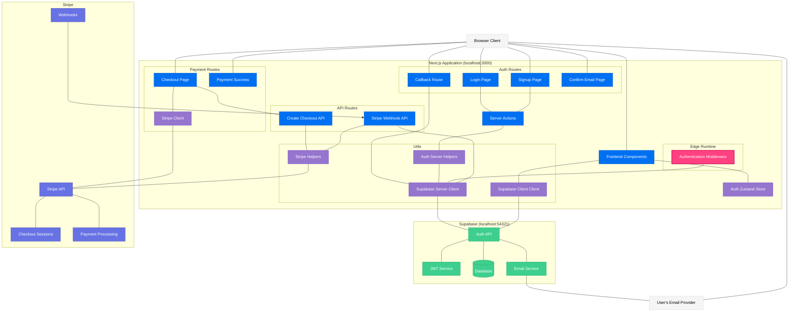

**Jiggle Bliss Site**

```mermaid
flowchart TB
    %% Client-side components
    Client[Browser Client]
    
    %% Next.js application
    subgraph "Next.js Application (localhost:3000)"
        FE[Frontend Components]
        SA[Server Actions]
        
        subgraph "Auth Routes"
            Login[Login Page]
            Signup[Signup Page]
            Callback[Callback Route]
            ConfirmEmail[Confirm Email Page]
        end
        
        subgraph "Payment Routes"
            Checkout[Checkout Page]
            Success[Payment Success]
            StripeClient[Stripe Client]
        end
        
        subgraph "Edge Runtime"
            MW[Authentication Middleware]
        end
        
        subgraph "API Routes"
            WebhookAPI[Stripe Webhook API]
            CheckoutAPI[Create Checkout API]
        end
        
        AuthStore[Auth Zustand Store]
        
        %% Server utilities
        subgraph "Utils"
            ServerClient[Supabase Server Client]
            ClientClient[Supabase Client Client]
            ServerHelpers[Auth Server Helpers]
            StripeHelpers[Stripe Helpers]
        end
    end
    
    %% Supabase services
    subgraph "Supabase (localhost:54321)"
        AuthAPI[Auth API]
        JWT[JWT Service]
        DB[(Database)]
        EmailService[Email Service]
    end
    
    %% Stripe services
    subgraph "Stripe"
        StripeAPI[Stripe API]
        StripeCheckout[Checkout Sessions]
        StripeWebhooks[Webhooks]
        StripePayments[Payment Processing]
    end
    
    %% External services
    UserEmail[User's Email Provider]
    
    %% Primary connections (without detailed flows)
    Client --- FE
    Client --- Login
    Client --- Signup
    Client --- Callback
    Client --- ConfirmEmail
    Client --- Checkout
    Client --- Success
    
    FE --- AuthStore
    Login --- SA
    Signup --- SA
    Callback --- ServerClient
    
    SA --- ServerHelpers
    ServerHelpers --- ServerClient
    FE --- ClientClient
    MW --- ServerClient
    
    Checkout --- CheckoutAPI
    Checkout --- StripeClient
    StripeClient --- StripeAPI
    
    CheckoutAPI --- StripeHelpers
    StripeHelpers --- StripeAPI
    
    WebhookAPI --- StripeHelpers
    StripeWebhooks ----> WebhookAPI
    WebhookAPI --- ServerClient
    
    StripeAPI --- StripeCheckout
    StripeAPI --- StripePayments
    
    ServerClient --- AuthAPI
    ClientClient --- AuthAPI
    AuthAPI --- JWT
    AuthAPI --- DB
    AuthAPI --- EmailService
    EmailService --- UserEmail
    UserEmail --- Client
    
    %% Styling
    classDef nextjs fill:#0070f3,color:white,stroke:#0057c3,stroke-width:1px;
    classDef supabase fill:#3ecf8e,color:white,stroke:#25a872,stroke-width:1px;
    classDef client fill:#f5f5f5,color:black,stroke:#d4d4d4,stroke-width:1px;
    classDef utils fill:#9575cd,color:white,stroke:#7953d2,stroke-width:1px;
    classDef stripe fill:#6772e5,color:white,stroke:#4b51ac,stroke-width:1px;
    classDef edge fill:#ff4081,color:white,stroke:#c60055,stroke-width:2px;
    
    class FE,SA,Login,Signup,Callback,ConfirmEmail,Checkout,Success,CheckoutAPI,WebhookAPI nextjs;
    class MW edge;
    class AuthAPI,JWT,DB,EmailService supabase;
    class Client,UserEmail client;
    class ServerClient,ClientClient,ServerHelpers,AuthStore,StripeHelpers,StripeClient utils;
    class StripeAPI,StripeCheckout,StripeWebhooks,StripePayments stripe;
```
